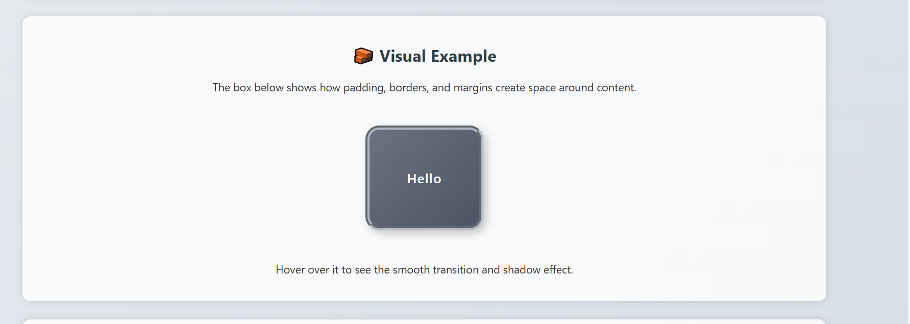

#  CSS Box Model Demonstration

This HTML file visually demonstrates the **CSS Box Model** — one of the most important concepts in web design.  
It helps learners understand how **content**, **padding**, **border**, and **margin** work together to define an element’s total space on a webpage.

---

## CSS Box Model Explanation:

The **CSS Box Model** treats every HTML element as a rectangular box made up of four layers:

1. **Content** — The actual text or image inside the box.  
2. **Padding** — The space between the content and the border.  
3. **Border** — A visible line wrapping around the padding and content.  
4. **Margin** — The outer space separating the box from other elements.

These layers combine to define the element’s total size and spacing.

---

## Features of This Demo

- Simple and modern **HTML + CSS** structure.
- Visual demonstration of box model properties.
- Hover animation using `transform` and `box-shadow`.
- Clean layout with readable color palette.
- Clear explanations inside the web page.

---

## How to Try This Example

1. Create a file named `box-model.html` (or use your existing one).  
2. Copy and paste the provided code into the file.  
3. Save it and open it in your browser.  
4. Hover over the box labeled **“Hello”** to see the shadow and animation.  
5. Experiment by changing:
   - `padding`
   - `border`
   - `margin`
   - `box-shadow`
   - `width` / `height`

Observe how each property affects the layout and spacing.

---

##  Box Model Diagram


---

## CSS Properties Explained

| Property | Description |
|-----------|-------------|
| `width`, `height` | Define content box size |
| `padding` | Adds inner spacing inside the border |
| `border` | Creates a visible edge around the element |
| `margin` | Adds outer spacing between elements |
| `box-shadow` | Creates depth and elevation |
| `transition` | Smoothly animates changes on hover |

---

## Screenshot of Output

```html

